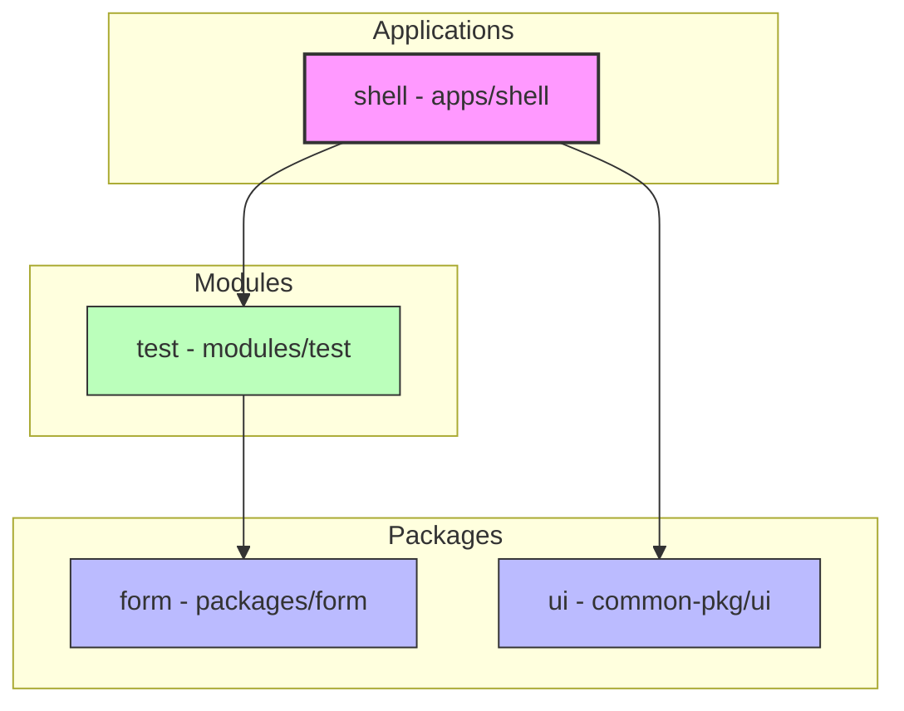

# Project Structure & Component Utilization

This document outlines the project structure and how components from different packages/submodules are utilized across the repository.

## Directory Overview

```text
root/
├── apps/
│   └── shell/              # Main React application (Consumer)
├── common-pkg/             # Git Submodule for shared resources
│   └── ui/                 # Shared UI components (Sidebar, etc.)
├── packages/
│   └── form/               # Shared Form components/logic
├── modules/
│   └── test/               # Feature modules or test data configurations
└── tsconfig.base.json      # Path aliases definition
```

## Component Utilization Flow

The project utilizes a monorepo-style structure where `apps` consume `packages`, `modules`, and `submodules`.

### 1. Dependency Graph

This diagram shows the hierarchical dependencies between the applications, modules, and packages.



### 2. Dependency Table
| Package | Path | Depends On | Purpose |
| :--- | :--- | :--- | :--- |
| `shell` | `apps/shell` | `ui`, `test` | Main application entry point and layout. |
| `test` | `modules/test` | `form` | Feature configurations and test data aggregation. |
| `ui` | `common-pkg/ui` | *None* | Shared primitive UI components (Submodule). |
| `form` | `packages/form` | *None* | Shared form-specific logic and components. |

### 3. Implementation Details

#### **Alias Mapping (`tsconfig.base.json`)**
The following aliases allow packages to import each other using clean names instead of relative paths:
- `ui` -> `common-pkg/ui/src/index.ts`
- `form` -> `packages/form/src/index.ts`
- `test` -> `modules/test/src/index.ts`

#### **Example: `apps/shell`**
The shell application acts as the orchestrator:
```tsx
import { Sidebar } from 'ui';       // From common-pkg/ui
import { testRoutes } from 'test'; // From modules/test

export function App() {
  return (
    <div>
      <Sidebar routes={testRoutes} />
      {/* ... routes ... */}
    </div>
  );
}
```

#### **Example: `modules/test`**
A module can aggregate components from other packages to define configurations:
```ts
import { FormComponent } from 'form'; // From packages/form

export const testRoutes = [
  {
    path: '/test-form',
    name: 'Test Form',
    element: FormComponent,
  },
];
```

## Build System
The project uses **Nx** with **Rollup** for building individual packages and the main application, ensuring that dependencies are resolved correctly during both development and production builds.
